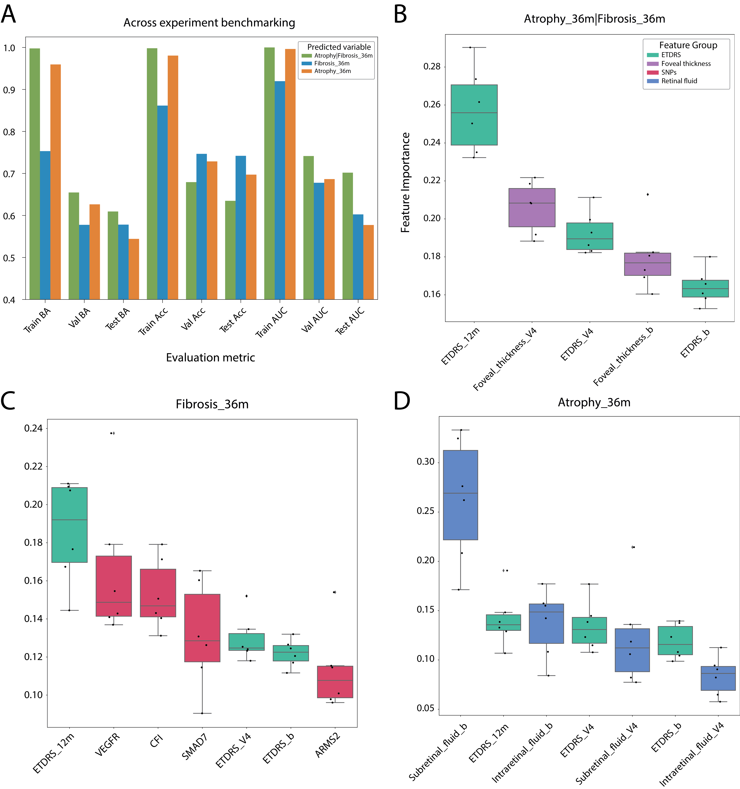

# Suitability of Machine Learning for Atrophy and Fibrosis Development in Neovascular Age-Related Macular Degeneration.
Code and Data materials

## Abstract
Anti-VEGF therapy has reduced the risk of legal blindness on neovascular age-related macular degeneration (nAMD), but still several patients develop fibrosis or atrophy in the long-term. Although recent statistical analyses have associated genetic, clinical and imaging biomarkers with the prognosis of patients with nAMD, no studies on the suitability of machine learning (ML) techniques have been conducted. We perform an extensive analysis on the use of ML to predict fibrosis and atrophy development on nAMD patients at 36 months from start of anti-VEGF treatment, using only data from the first 12 months. We use data collected according to real-world practice, which includes clinical and genetic factors. The ML analysis identifies as important mainly clinical features already known to have a statistical power for prognosis, with genetic variables not showing much statistical relevance. The analysis also reveals that predicting one macular degeneration is a complex task given the available data, obtaining in the best case a balance accuracy of 63\% and an AUC of 0.72. The lessons learnt during the development of this work can guide future ML-based prediction tasks within the ophthalmology field and help design the data collection process.

Figure 1 showing the Minor Allele Frequency (MAF) differences between Atrophy/non-Atrophy and Fibrosis/non-Fibrosis patients.

Figure 2 showing the distribution of the relative AUC (rAUC) for each group of features.

Figure 3 showing the importance scores and evaluation metrics of the final models for each prediction task.

The folder **input** contains all the necessary data files to generate the figures and tables from the manuscript.

1 - FIS_dataset.txt (dataset **PI15/01374**) contains the used dataset for the ML prediction task.
2 - allele_frequencies.tsv contains the table used for the SNP study
3 - Atrophy_36m_best_conf_6_6.zip, Fibrosis_36m_best_conf_6_6.zip and healthy_ill_best_conf_6_6.zip contain the best configuration from the grid-search. 
4 - mean_rAUC_per_group_of_features.tsv contains a table with the mean relative AUC per group of features.

The folder **scripts** contains all the necessary scripts to generate the figures and tables from the manuscript.

1 - figure1, figure2 figure3, and supplementary_figure1 can be run to generate figure1, figure2, figure3 and supplementary_figure1, respectively
2 - intermediate_scripts folder can generate necessary tables and figures for the analysis shown in the manuscript.
